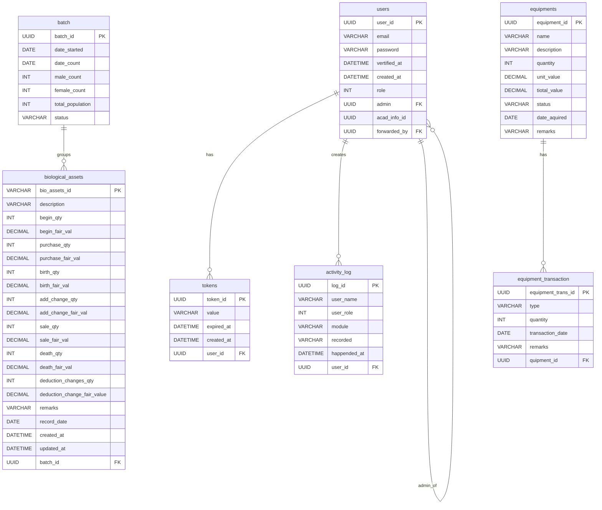

# System Table Structure

This folder contains copy/paste-ready database structure docs.

## Files

- `system_tables.sql`: SQL script to create all requested tables.
- `system_tables.svg`: Visual ER diagram image.
- `system_tables.md`: This reference document.

## Quick Apply

```sql
-- PostgreSQL example
\i system_architecture/system_tables.sql
```

## Tables Included

- users
- tokens
- activity_log
- batch
- biological_assets
- equipments
- equipment_transaction

## Relationship Summary

- `tokens.user_id` -> `users.user_id`
- `activity_log.user_id` -> `users.user_id`
- `users.admin` -> `users.user_id` (self-reference)
- `users.forwarded_by` -> `users.user_id` (self-reference)
- `biological_assets.batch_id` -> `batch.batch_id`
- `equipment_transaction.quipment_id` -> `equipments.equipment_id`

## ER Diagram (Mermaid)



## Naming Note

Requested field names were preserved as provided (including spellings like `vertified_at`, `happended_at`, `tiotal_value`, and `quipment_id`) so your copy/paste stays aligned with your request.
